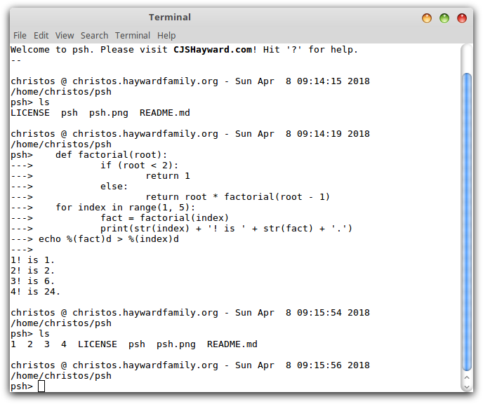

# psh
An experimental command line shell based on Python.

It is intended to be a shell that lets users use Python for its shell
scripting.

Version 0.0a. To run it, run:

$ git checkout https://github.com/CJSHayward/psh.git  
$ psh/psh



## Batteries included

psh comes with full Python power. Indent by one or more tabs (four spaces are
considered a tab), and you are no longer issuing individual shell commands;
you're programming in Python.

Drop the initial tabs and a shell line will be included in your code, *with
variable interpolation*.

A blank line terminates the Python or mixed block.

Please note that programming your ~/.pshrc file can be very useful.

## Only say one thing!

In a standard shell, you can only run a program (or builtin, etc.) by
specifying the name of the command. In CJSH, you can:

* Give the name of a program and run that program.
* Give the name of a directory and change directory to that directory.
* Give the name of an editable file and load it in the appropriate editor.

If an appropriate candidate file is not found in the current directory, it will
be searched for in the directory heirarchy. This means that if you are in a
project directory, and a filename is unique, you should be able to give just
the filename, without a path, and open it in your editor.


## Shell basics

CJSH supports various basics such as environmental variables and aliases.
Environmental variables are simply assigned:

```
foo=bar
```

Aliases take the following form:

```
alias foo=bar
```

Python variables can be assigned using Python's syntax after an indent:

```
	foo=bar
```

## .pshrc file setup

.pshrc files are growing in power. The power explicitly includes the ability
to set aliases and environmental variables, and program Python to do things you
want. The syntax for Python is essentially the same as the shell.

## Not yet contributed (*Patches welcome!*)

* Tab completion
* Job control

**[C.J.S. Hayward](https://CJSHayward.com)**
[Amazon](http://amazon.com/author/cjshayward), [Email](mailto:christos.jonathan.hayward@gmail.com), [Flagship Site](https://cjshayward.com)LinkedIn - I'm looking for work in UX!](LinkedIn.com.in/jonathanhayward)
